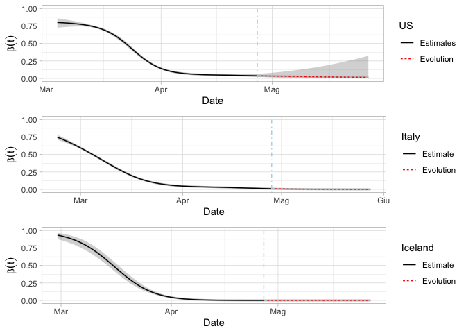
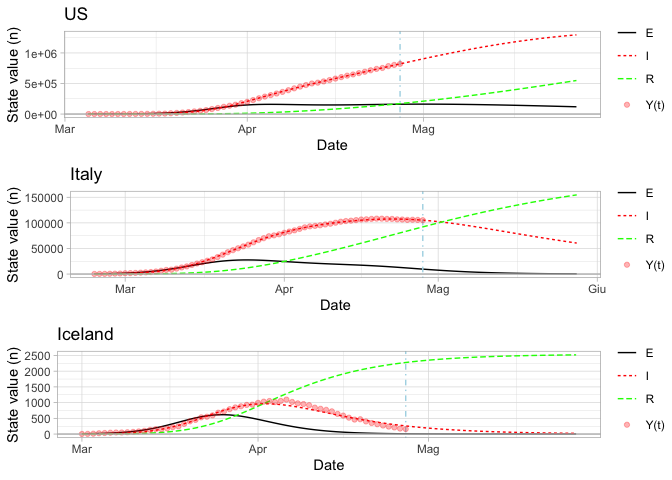
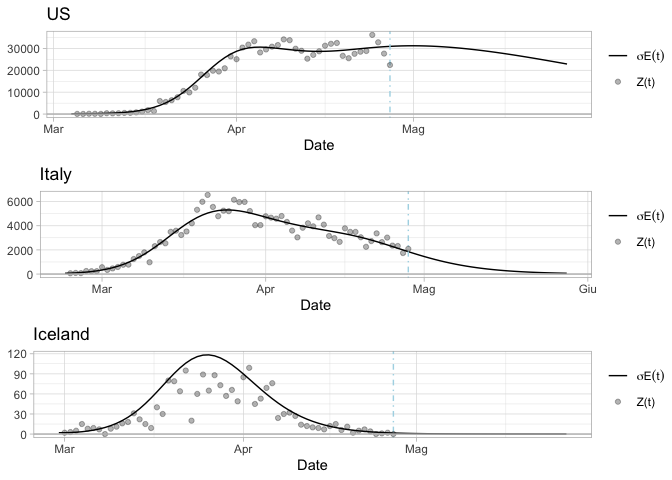

<a rel="license" href="http://creativecommons.org/licenses/by-nc/4.0/"></a><br />This
work is licensed under a
<a rel="license" href="http://creativecommons.org/licenses/by-nc/4.0/">Creative
Commons Attribution-NonCommercial 4.0 International License</a>.

# Disclaimer

  - This is a supporting file for reproducing the analysis of the paper
    “A SEIR model with time-varying cofficients for analysing the
    SARS-CoV-2 epidemic”.

  - We want to investigate the evolution of the coronavirus pandemic in
    the US, Italy and Iceland from a statistical perspective using
    aggregated data.

  - We use data provided by the repository of the Italian Civil
    Protection Department for Italy and Johns-Hopkins University for the
    US and Iceland.

## The SARS-CoV-2 datasets

The present analysis started from the dataset on COVID19 updated in
<https://github.com/pcm-dpc/COVID-19>, database provided by the Italian
Civil Protection and <https://github.com/CSSEGISandData/COVID-19>
database provided by the JHU.  
The analysis was limited up to 27 April 2020, the used files has been
download in the repository.

and load them.

``` r
library(fda)
```

    ## Loading required package: splines

    ## Loading required package: Matrix

    ## 
    ## Attaching package: 'fda'

    ## The following object is masked from 'package:graphics':
    ## 
    ##     matplot

``` r
library(xts)
```

    ## Loading required package: zoo

    ## 
    ## Attaching package: 'zoo'

    ## The following objects are masked from 'package:base':
    ## 
    ##     as.Date, as.Date.numeric

``` r
library(numDeriv)
library(deSolve)
library(boot)
```

    ## 
    ## Attaching package: 'boot'

    ## The following object is masked from 'package:fda':
    ## 
    ##     melanoma

``` r
library(crop)
library(ggplot2)
library(knitr)
library(splines)
library(gridExtra)
```

## Load datasets and functions (Italy, US, Iceland )

``` r
#clean 
rm(list=ls())
#load datasets
Italy<-read.csv("Italy04_27_2020.csv",header=TRUE)
US<-read.csv("US04_27_2020.csv",header=TRUE)
Iceland<-read.csv("Iceland04_27_2020.csv",header=TRUE)
source("functions.R")
#from raw to analysed data (cut to the selected window)
############Italy
names(Italy)[1]<-"t"
#correct the inital number of new cases. 155 day before was taken by GHU for Italy 23/02
Italy$nuovi_positivi[1]<-(Italy$totale_positivi[1]-155)
days_I<-dim(Italy)[1]
#Date 
Italy$date<-seq(as.Date("2020-02-24"),as.Date("2020-02-24")+dim(Italy)[1]-1,1)
### Figure 1
ylim.prim <- range(Italy$nuovi_positivi)
ylim.sec <- range(Italy$totale_positivi)
b <- diff(ylim.prim)/diff(ylim.sec)
a <- b*(ylim.prim[1] - ylim.sec[1])
colnames(Italy) <- make.unique(names(Italy))
g1_1<-ggplot(Italy, aes(x=date, y=nuovi_positivi)) +
        geom_line()+theme_light() +
        geom_line(aes(y =  a+ totale_positivi*b), linetype=2,color = "red") +
        scale_y_continuous("New cases", sec.axis = sec_axis(~ (. - a)/b, name = "Current cases")) +ggtitle("Italy") 
############US
US$nuovi_positivi<-c(0,diff(US$Confirmed))
US$totale_positivi<-US$Confirmed-US$Recovered-US$Deaths
US$nuovi_removed<-c(0,diff(US$Recovered+US$Deaths))
US$removed<-US$Recovered+US$Deaths
#since 05/03 >200 cases, since day 44

US<-US[-c(1:43),]
days_U<-dim(US)[1]
US$t<-1:days_U
US$date<-seq(as.Date(substr(US$Date[1],1,10)),as.Date(substr(US$Date[1],1,10))+dim(US)[1]-1,1)
### Figure 1(b)
ylim.prim <- range(US$nuovi_positivi)
ylim.sec <- range(US$totale_positivi)
b <- diff(ylim.prim)/diff(ylim.sec)
a <- b*(ylim.prim[1] - ylim.sec[1])
colnames(US) <- make.unique(names(US))
g1_2<-ggplot(US, aes(date, nuovi_positivi)) +
        geom_line()+theme_light() +
        geom_line(aes(y =  a+ totale_positivi*b),linetype=2, color = "red") +
        scale_y_continuous("New cases", sec.axis = sec_axis(~ (. - a)/b, name = "Current cases")) +ggtitle("US") 
############US
Iceland$nuovi_positivi<-c(0,diff(Iceland$Confirmed))
Iceland$totale_positivi<-Iceland$Confirmed-Iceland$Recovered-Iceland$Deaths
Iceland$nuovi_removed<-c(0,diff(Iceland$Recovered+Iceland$Deaths))
Iceland$removed<-Iceland$Recovered+Iceland$Deaths
#Iceland since 01/03 , since day 40
Iceland<-Iceland[-c(1:39),]
days_Ic<-dim(Iceland)[1]
Iceland$t<-1:days_Ic
Iceland$date<-seq(as.Date(substr(Iceland$Date[1],1,10)),as.Date(substr(Iceland$Date[1],1,10))+dim(Iceland)[1]-1,1)
### Figure 1(c)
ylim.prim <- range(Iceland$nuovi_positivi)
ylim.sec <- range(Iceland$totale_positivi)
b <- diff(ylim.prim)/diff(ylim.sec)
a <- b*(ylim.prim[1] - ylim.sec[1])
colnames(Iceland) <- make.unique(names(Iceland))
g1_3<-ggplot(Iceland, aes(date, nuovi_positivi)) +
        geom_line()+theme_light() +
        geom_line(aes(y =  a+ totale_positivi*b),linetype=2, color = "red") +
        scale_y_continuous("New cases", sec.axis = sec_axis(~ (. - a)/b, name = "Current cases"))+ggtitle("Iceland") 
g1_1
```

<!-- -->

``` r
g1_2
```

<!-- -->

``` r
g1_3
```

<!-- -->

``` r
pdf("figure1.pdf")
grid.arrange(g1_2,g1_1,g1_3,nrow=3)
dev.off.crop()
```

## Define initial Status for SEIR model

``` r
#Italy #E(0) = (I(2)-I(1))/gamma
pop_Italy=60317000
status0_Italy<-c(S=(pop_Italy-(5.2*Italy$nuovi_positivi[1]+155+0)),
                 E=5.2*Italy$nuovi_positivi[1]
                 ,I=155,R=0)
#US
pop_US<-329227746
status0_US<-c(S=(329227746-(5.2*US$nuovi_positivi[1]+155+0)),
                 E=5.2*US$nuovi_positivi[1]
                 ,I=142,R=7)
#Iceland
pop_Iceland<-364124
status0_Iceland<-c(S=(364124-(5.2*Iceland$nuovi_positivi[1]+1+0)),
                 E=5.2*Iceland$nuovi_positivi[1]
                 ,I=1,R=0)
#Initial status, however gamma will be estimated
theta0_Italy<-c(mu = 1/(365.25*83.2), sigma = 1/5.2, gamma =1/18, N=pop_Italy)
theta0_US<-c(mu = 1/(365.25*78.5), sigma = 1/5.2, gamma =1/18, N=pop_US)
theta0_Iceland<-c(mu = 1/(365.25*82.2), sigma = 1/5.2, gamma =1/18, N=pop_Iceland)
#forecast 
ahead<-30
```

## FIT SEIR\_TV model

This part may take some minutes.

``` r
#SEIR_TV function
#(STATE, DAYS OF OBS, INITIAL PAR (gamma, psi coefs), SEIR PAR, SEIR STATUS, number of knots, number of days forward)
# number of knots was defined by means of CLIC index in sandwich() function
#nknots 5 for Italy and US, 3 for Iceland
est_italy<-SEIR_TV(Italy,days_I,par_start=c(-3,seq(0,-4,len=5)),theta0_Italy,status0_Italy,nknots=5,ahead=ahead)
est_US<-SEIR_TV(US,days_U,par_start=c(-4.4,seq(1,-4,len=5)),theta0_US,status0_US,nknots=5,ahead=ahead)
est_Iceland<-SEIR_TV(Iceland,days_Ic,par_start=c(-2.5,seq(0,-5,len=3)),theta0_Iceland,status0_Iceland,nknots=3,ahead=ahead)
```

## CHECK Fitting in Italy

``` r
#obtain the coefficient estimates
gamma_hat_It<-inv.logit(est_italy$fit$estimate[1])
mut_It<-as.numeric(est_italy$X.new%*%est_italy$fit$estimate[-1])
betat_It<-inv.logit(mut_It)
####CHECK from a SEIR model
theta_con_beta_Italy<-list(mu =theta0_Italy[1], sigma = theta0_Italy[2], 
                     gamma =gamma_hat_It,N=theta0_Italy[4],beta=betat_It)
times <- seq(0,days_I, by = 1) 
out <- ode(y=status0_Italy, times=times, func=SEIR.model, parms=theta_con_beta_Italy,method = "lsode")
#####
par(mfrow=c(1,3))
plot(out[-1,"I"],type="l")
points(Italy$totale_positivi)
plot(out[-days_I,"E"]*theta0_Italy[2],type="l")
points(Italy$nuovi_positivi)
plot(out[-1,"R"],type="l")
points(Italy$dimessi_guariti+Italy$dimessi_guariti)
```

<!-- -->

``` r
par(mfrow=c(1,1))
##
```

## CHECK Fitting in US

``` r
#obtain the coefficient estimates
gamma_hat_US<-inv.logit(est_US$fit$estimate[1])
mut_US<-as.numeric(est_US$X.new%*%est_US$fit$estimate[-1])
betat_US<-inv.logit(mut_US)
####CHECK from a SEIR model
theta_con_beta_US<-list(mu =theta0_US[1], sigma = theta0_US[2], 
                     gamma =gamma_hat_US,N=theta0_US[4],beta=betat_US)
times <- seq(0,days_U, by = 1) 
out <- ode(y=status0_US, times=times, func=SEIR.model, parms=theta_con_beta_US,method = "lsode")
#####
par(mfrow=c(1,3))
plot(out[-1,"I"],type="l")
points(US$totale_positivi)
plot(out[-days_I,"E"]*theta0_US[2],type="l")
points(US$nuovi_positivi)
plot(out[-1,"R"],type="l")
points(US$removed)
```

<!-- -->

``` r
par(mfrow=c(1,1))
##
```

## CHECK Fitting in Iceland

``` r
#obtain the coefficient estimates
gamma_hat_Ic<-inv.logit(est_Iceland$fit$estimate[1])
mut_Ic<-as.numeric(est_Iceland$X.new%*%est_Iceland$fit$estimate[-1])
betat_Ic<-inv.logit(mut_Ic)
####CHECK from a SEIR model
theta_con_beta_Iceland<-list(mu =theta0_Iceland[1], sigma = theta0_Iceland[2], 
                     gamma =gamma_hat_Ic,N=theta0_Iceland[4],beta=betat_Ic)
times <- seq(0,days_Ic, by = 1) 
out <- ode(y=status0_Iceland, times=times, func=SEIR.model, parms=theta_con_beta_Iceland,method = "lsode")
#####
par(mfrow=c(1,3))
plot(out[-1,"I"],type="l")
points(Iceland$totale_positivi)
plot(out[-days_Ic,"E"]*theta0_Iceland[2],type="l")
points(Iceland$nuovi_positivi)
plot(out[-1,"R"],type="l")
points(Iceland$removed)
```

<!-- -->

``` r
par(mfrow=c(1,1))
##
```

## ESTIMATES HAC SANDWICH VAR/COV matrix for estimated coefficients

ITALY

``` r
a_italy<-sandwich(est_italy$fit, parameters=theta0_Italy ,initials=status0_Italy,
        obs=est_italy$obs,X=est_italy$X, type ="poisson",kernel.type = "NW",lag=5,obs2 = est_italy$obs2)
#varcov_italy<-diag(est_italy$X%*%a_italy$varcov[-1,-1]%*%t(est_italy$X))
varcov.hac_italy<<-diag(est_italy$X.new%*%a_italy$varcov.hac[-1,-1]%*%t(est_italy$X.new))
####### We considered only an HAC varcov matrix, however a comparison can be made
alpha<-0.05;q<-qnorm(1-alpha/2)
#gamma hat
gamma_hat_It
```

    ## [1] 0.02483096

``` r
#95% IC
inv.logit(est_italy$fit$estimate[1]+c(-1,1)*q*sqrt(a_italy$varcov.hac[1,1]))
```

    ## [1] 0.02320960 0.02656251

``` r
#beta hat and 95CI
sd_italy<-sqrt(varcov.hac_italy)
lower_italy<-inv.logit(mut_It-q*sd_italy)
upper_italy<-inv.logit(mut_It+q*sd_italy)
```

The US

``` r
a_US<-sandwich(est_US$fit, parameters=theta0_US ,initials=status0_US,
        obs=est_US$obs,X=est_US$X, type ="poisson",kernel.type = "NW",lag=5,obs2 = est_US$obs2)
#varcov_US<-diag(est_Iceland$X%*%a_iceland$varcov[-1,-1]%*%t(est_Iceland$X))
varcov.hac_US<-diag(est_US$X.new%*%a_US$varcov.hac[-1,-1]%*%t(est_US$X.new))
####### We considered only an HAC varcov matrix, however a comparison can be made
#gamma hat
gamma_hat_US
```

    ## [1] 0.01151017

``` r
#95% IC
inv.logit(est_US$fit$estimate[1]+c(-1,1)*q*sqrt(a_US$varcov.hac[1,1]))
```

    ## [1] 0.009985604 0.013264393

``` r
#beta hat and 95CI
sd_US<-sqrt(varcov.hac_US)
lower_US<-inv.logit(mut_US-q*sd_US)
upper_US<-inv.logit(mut_US+q*sd_US)
```

ICELAND

``` r
a_iceland<-sandwich(est_Iceland$fit, parameters=theta0_Iceland ,initials=status0_Iceland,
        obs=est_Iceland$obs,X=est_Iceland$X, type ="poisson",kernel.type = "NW",lag=5,obs2 = est_Iceland$obs2)
#varcov_iceland<-diag(est_Iceland$X%*%a_iceland$varcov[-1,-1]%*%t(est_Iceland$X))
varcov.hac_iceland<<-diag(est_Iceland$X.new%*%a_iceland$varcov.hac[-1,-1]%*%t(est_Iceland$X.new))
####### We considered only an HAC varcov matric, however a comparison can be made
#gamma hat
gamma_hat_Ic
```

    ## [1] 0.083552

``` r
#95% IC
inv.logit(est_Iceland$fit$estimate[1]+c(-1,1)*q*sqrt(a_iceland$varcov.hac[1,1]))
```

    ## [1] 0.06532355 0.10628865

``` r
#beta hat and 95CI
sd_iceland<-sqrt(varcov.hac_iceland)
lower_iceland<-inv.logit(mut_Ic-q*sd_iceland)
upper_iceland<-inv.logit(mut_Ic+q*sd_iceland)
```

## Results with forecast - Figure 2

``` r
times.new_It <- seq(0,days_I+ahead, by = 1) 
times.new_US <- seq(0,days_U+ahead, by = 1) 
times.new_Ic <- seq(0,days_Ic+ahead, by = 1) 
out.new_It <- ode(y=status0_Italy, times=times.new_It, func=SEIR.model, parms=theta_con_beta_Italy,method = "lsode")
out.new_US <- ode(y=status0_US, times=times.new_US, func=SEIR.model, parms=theta_con_beta_US,method = "lsode")
out.new_Ic <- ode(y=status0_Iceland, times=times.new_Ic, func=SEIR.model, parms=theta_con_beta_Iceland,method = "lsode")
fig2_it<-data.frame(Beta=betat_It,
                    Date=seq(Italy$date[1]-1,Italy$date[1]+days_I+ahead-1,1)
                      ,lower_bound=lower_italy,upper_bound=upper_italy,
                    Italy=c(rep("Estimate",days_I+1),rep("Evolution",ahead)))
g2_it<-ggplot(fig2_it, aes(x = Date, y = Beta)) +
        geom_smooth(aes(x=Date, y=Beta, ymax=upper_bound, ymin=lower_bound), 
                    data=fig2_it, stat='identity',col="grey")+
        ylab(expression(beta(t))) +scale_color_manual(values = c("black", "red"))+
        geom_line(aes(color = Italy, linetype = Italy))+ylim(0, 1)+
        theme_light() + 
        geom_vline(xintercept = fig2_it$Date[days_I+1],lty=4,color="lightblue")

fig2_us<-data.frame(Beta=betat_US,
                    Date=seq(US$date[1]-1,US$date[1]+days_U+ahead-1,1)
                      ,lower_bound=lower_US,upper_bound=upper_US,
                    US=c(rep("Estimates",days_U+1),rep("Evolution",ahead)))
g2_us<-ggplot(fig2_us, aes(x = Date, y = Beta)) +
        geom_smooth(aes(x=Date, y=Beta, ymax=upper_bound, ymin=lower_bound), 
                    data=fig2_us, stat='identity',col="grey")+
        ylab(expression(beta(t))) +scale_color_manual(values = c("black", "red"))+
        geom_line(aes(color = US, linetype = US))+ylim(0, 1)+
        theme_light() +
        geom_vline(xintercept = fig2_us$Date[days_U+1],lty=4,color="lightblue")

fig2_ic<-data.frame(Beta=betat_Ic,
                    Date=seq(Iceland$date[1]-1,Iceland$date[1]+days_Ic+ahead-1,1)
                      ,lower_bound=lower_iceland,upper_bound=upper_iceland,
                    Iceland=c(rep("Estimate",days_Ic+1),rep("Evolution",ahead)))
g2_ic<-ggplot(fig2_ic, aes(x = Date, y = Beta)) +
        geom_smooth(aes(x=Date, y=Beta, ymax=upper_bound, ymin=lower_bound), 
                    data=fig2_ic, stat='identity',col="grey")+
        ylab(expression(beta(t))) +scale_color_manual(values = c("black", "red"))+
        geom_line(aes(color = Iceland, linetype = Iceland))+ylim(0, 1)+
        theme_light() + 
        geom_vline(xintercept = fig2_ic$Date[days_Ic+1],lty=4,color="lightblue")
grid.arrange(g2_us,g2_it,g2_ic)
```

<!-- -->

``` r
pdf("figure2.pdf")
grid.arrange(g2_us,g2_it,g2_ic,nrow=3)  
dev.off.crop()
```

## Figure 3

``` r
fig3_it<-data.frame(n=c(out.new_It[-1,3],out.new_It[-1,4],out.new_It[-1,5]),
                    Date=rep(fig2_it$Date[-1],3),State=c(rep("E",days_I+ahead),rep("I",days_I+ahead),rep("R",days_I+ahead)))
g3_it<-ggplot(fig3_it, aes(y=n,x=Date)) +
        geom_line(aes(color = State, linetype = State)) + 
        scale_color_manual(values = c("black","red","green"))+ 
        ylab("State value (n)")+ggtitle("Italy") +
        geom_vline(xintercept = fig3_it$Date[days_I],lty=4,color="lightblue")+
        geom_point(data=Italy,aes(x=date, y=totale_positivi, fill= "Y(t)"), colour="red",alpha = 3/10)+
        geom_hline(yintercept = 0,col="grey") +
        theme_light() +
        theme(legend.title=element_blank()) +
        theme(legend.margin = margin(-0.5,0,0,0, unit="cm"))
fig3_us<-data.frame(n=c(out.new_US[-1,3],out.new_US[-1,4],out.new_US[-1,5]),
                    Date=rep(fig2_us$Date[-1],3),State=c(rep("E",days_U+ahead),rep("I",days_U+ahead),rep("R",days_U+ahead)))
g3_us<-ggplot(fig3_us, aes(y=n,x=Date)) +
        geom_line(aes(color = State, linetype = State)) + 
        scale_color_manual(values = c("black","red","green"))+ 
        ylab("State value (n)")+ggtitle("US") +
        geom_vline(xintercept = fig3_us$Date[days_U],lty=4,color="lightblue")+
        geom_point(data=US,aes(x=date, y=totale_positivi, fill= "Y(t)"), colour="red",alpha = 3/10)+
        geom_hline(yintercept = 0,col="grey") +
        theme_light() +
        theme(legend.title=element_blank()) +
        theme(legend.margin = margin(-0.5,0,0,0, unit="cm"))
fig3_ic<-data.frame(n=c(out.new_Ic[-1,3],out.new_Ic[-1,4],out.new_Ic[-1,5]),
                    Date=rep(fig2_ic$Date[-1],3),State=c(rep("E",days_Ic+ahead),rep("I",days_Ic+ahead),rep("R",days_Ic+ahead)))
g3_ic<-ggplot(fig3_ic, aes(y=n,x=Date)) +
        geom_line(aes(color = State, linetype = State)) + 
        scale_color_manual(values = c("black","red","green"))+ 
        ylab("State value (n)")+ggtitle("Iceland") +
        geom_vline(xintercept = fig3_ic$Date[days_Ic],lty=4,color="lightblue")+
        geom_point(data=Iceland,aes(x=date, y=totale_positivi, fill= "Y(t)"), colour="red",alpha = 3/10)+
        geom_hline(yintercept = 0,col="grey") +
        theme_light() +
        theme(legend.title=element_blank()) +
        theme(legend.margin = margin(-0.5,0,0,0, unit="cm"))
grid.arrange(g3_us,g3_it,g3_ic)
```

<!-- -->

``` r
pdf("figure3.pdf")
grid.arrange(g3_us,g3_it,g3_ic,nrow=3)  
dev.off.crop()
```

## Figure 4

``` r
fig4_it<-data.frame(sE=out.new_It[,3]/5.2,Date=fig2_it$Date,type="E")
g4_it<-ggplot(fig4_it, aes(y=sE,x=Date)) +geom_line( aes(y=sE,x=Date,col=type))+
        scale_colour_manual("", values="black",labels = c(expression(sigma*E(t))))+
        geom_vline(xintercept = fig2_it$Date[days_I+1],lty=4,color="lightblue")+
        ylab(expression(sigma*E(t)))+ggtitle("Italy") +
        geom_point(data=Italy,aes(x=date, y=nuovi_positivi, fill= "Z(t)"), colour="black",alpha = 3/10)+
        geom_hline(yintercept = 0,col="grey") +
        theme_light() + theme(axis.title.y=element_blank(),
                              legend.title=element_blank()) + 
        theme(legend.margin = margin(-0.5,0,0,0, unit="cm"))
fig4_us<-data.frame(sE=out.new_US[,3]/5.2,Date=fig2_us$Date,type="E")
g4_us<-ggplot(fig4_us, aes(y=sE,x=Date)) +geom_line( aes(y=sE,x=Date,col=type))+
        scale_colour_manual("", values="black",labels = c(expression(sigma*E(t))))+
        geom_vline(xintercept = fig2_us$Date[days_U+1],lty=4,color="lightblue")+
        ylab(expression(sigma*E(t)))+
        geom_point(data=US,aes(x=date, y=nuovi_positivi, fill= "Z(t)"), colour="black",alpha = 3/10)+geom_hline(yintercept = 0,col="grey")+ ggtitle("US") +
        theme_light() + theme(axis.title.y=element_blank(),
                              legend.title=element_blank()) + 
        theme(legend.margin = margin(-0.5,0,0,0, unit="cm"))

fig4_ic<-data.frame(sE=out.new_Ic[,3]/5.2,Date=fig2_ic$Date,type="E")
g4_ic<-ggplot(fig4_ic, aes(y=sE,x=Date)) +geom_line( aes(y=sE,x=Date,col=type))+
        scale_colour_manual("", values="black",labels = c(expression(sigma*E(t))))+
        geom_vline(xintercept = fig2_ic$Date[days_Ic+1],lty=4,color="lightblue")+
        ylab(expression(sigma*E(t)))+
        geom_point(data=Iceland,aes(x=date, y=nuovi_positivi, fill= "Z(t)"), colour="black",alpha = 3/10)+
        geom_hline(yintercept = 0,col="grey") +ggtitle("Iceland") +
        theme_light() + theme(axis.title.y=element_blank(),
                              legend.title=element_blank()) + 
        theme(legend.margin = margin(-0.5,0,0,0, unit="cm"))

grid.arrange(g4_us,g4_it,g4_ic)
```

<!-- -->

``` r
pdf("figure4.pdf")
grid.arrange(g4_us,g4_it,g4_ic,nrow=3)  
dev.off.crop()
```

## Figure 5

``` r
r0_it<-cbind(betat_It/gamma_hat_It)
r0_us<-cbind(betat_US/gamma_hat_US)
r0_ic<-cbind(betat_Ic/gamma_hat_Ic)
dataRO<-data.frame(Country=c(rep("Italy",length(r0_it)),rep("US",length(r0_us)),rep("Iceland",length(r0_ic))),
                   RO=c(r0_it,r0_us,r0_ic),
                   Date=c(fig2_it$Date,fig2_us$Date,fig2_ic$Date))
g5<-ggplot(dataRO, aes(y=RO,x=Date)) +
        geom_line(aes(color = Country, linetype = Country)) + 
        scale_color_manual(values = c("green", "black","red"))+ theme_light() +
        ylab(expression(R[O](t)==beta(t)/gamma))+
        scale_y_log10(breaks=c(0.2,0.5,1,5,10,15,20,50,100), limits=c(0.05,65) )  +
        geom_hline(yintercept = 1,lty=2)+ geom_vline(xintercept = fig2_it$Date[days_I],lty=4,color="lightblue")

g5
```

    ## Warning: Removed 68 row(s) containing missing values (geom_path).

<!-- -->

``` r
pdf("figure5.pdf")
g5 
```

    ## Warning: Removed 68 row(s) containing missing values (geom_path).

``` r
dev.off.crop()
```
